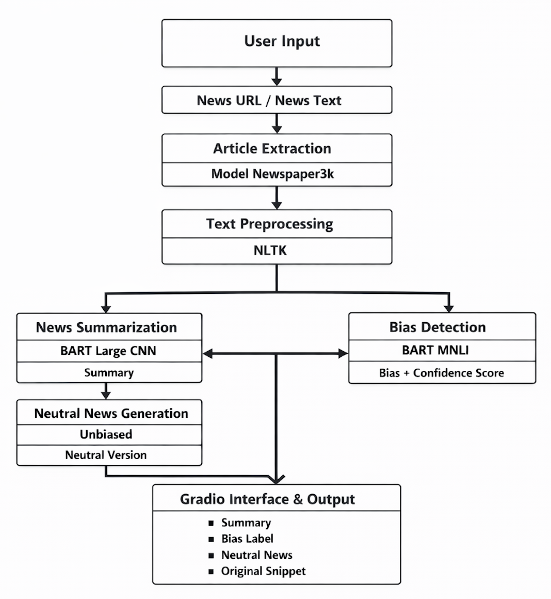

# AI Powered Personalized News Digest with Bias Detection

An NLP-based application that extracts news articles, generates concise summaries, detects political bias, and produces a more neutral version of the news content using transformer-based models.

## Overview

The **AI Powered Personalized News Digest with Bias Detection** project combines Natural Language Processing (NLP) and transformer models to analyze online news articles.

The system accepts a news article URL or news text as input and performs article extraction, text preprocessing, abstractive summarization, political bias detection, neutral news generation, and visualization through an interactive Gradio interface.

The project is implemented using Python and transformer-based models from Hugging Face.

## Key Features

- 📰 **News Article Extraction**
  - Extracts article content from a provided news URL.
  - Uses Newspaper3k for automated article extraction.

- 📝 **Abstractive News Summarization**
  - Uses BART Large CNN.
  - Generates a concise summary of the extracted news article.

- ⚖️ **Political Bias Detection**
  - Uses BART MNLI for zero-shot text classification.
  - Classifies news content into:
    - Left Wing
    - Center
    - Right Wing
  - Provides a confidence score for the predicted bias label.

- 🔄 **Neutral News Generation**
  - Generates a more neutral version of the news content.
  - Helps reduce strongly biased wording in the original article.

- 📊 **Bias Visualization**
  - Visualizes bias classification results using Matplotlib.

- 📈 **Model Evaluation**
  - Evaluates summarization using ROUGE metrics.
  - Evaluates classification using:
    - Accuracy
    - Precision
    - Recall
    - F1-score

- 🖥️ **Interactive Gradio Interface**
  - Provides a user-friendly interface for interacting with the complete pipeline.
  - Displays:
    - Summary
    - Bias Label
    - Neutral News
    - Original Snippet

## System Architecture

The overall system architecture is shown below:



### Workflow

```text
                         User Input
                             │
                             ▼
                  News URL / News Text
                             │
                             ▼
                    Article Extraction
                       (Newspaper3k)
                             │
                             ▼
                    Text Preprocessing
                          (NLTK)
                             │
                  ┌──────────┴──────────┐
                  │                     │
                  ▼                     ▼
          News Summarization       Bias Detection
          (BART Large CNN)          (BART MNLI)
                  │                     │
                  ▼                     ▼
               Summary            Bias + Confidence
                  │
                  ▼
          Neutral News Generation
                 (Unbiased)
                  │
                  ▼
            Neutral Version
                  │
                  └──────────┐
                             │
                             ▼
                 Gradio Interface & Output
                             │
              ┌──────────────┼──────────────┐
              ▼              ▼              ▼
           Summary       Bias Label    Neutral News
                                           
                             +
                      
                      Original Snippet